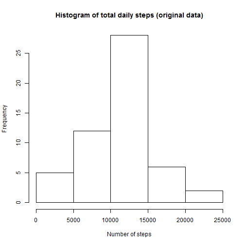
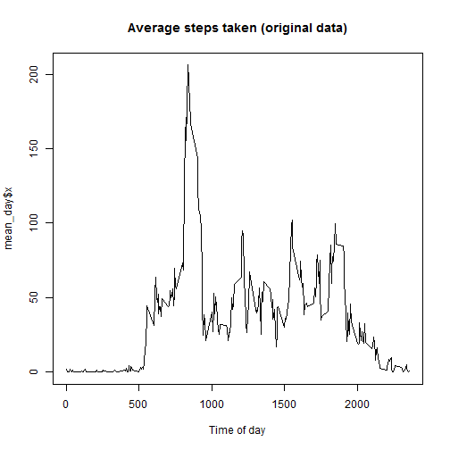
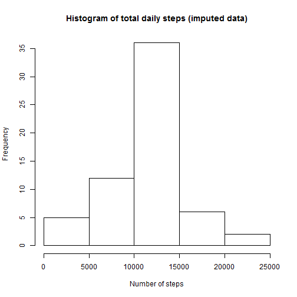
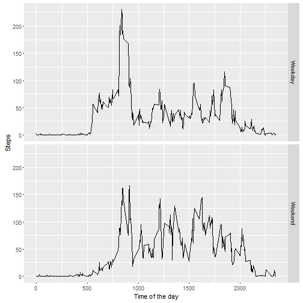

---

This report uses data from a personal activity monitoring device. The device collected data at 5 minute intervals through out the day from an anonymous individual during the months of October and November, 2012 and including the number of steps taken in 5 minute intervals each day.

The dataset is stored in a comma-separated-value (CSV) file and there are 17,568 observations. The variables are: 

* steps: Number of steps taking in a 5-minute interval (missing values are coded as )
* date: The date on which the measurement was taken in YYYY-MM-DD format
* interval: Identifier for the 5-minute interval in which measurement was taken in HHMM format

In this assignment, we'll explore the data to obtain some conclusions about the steps pattern of this individual.

---


###Loading packages and data

To illustrate our analysis, we will use the base and ggplot2 graphic systems.


```r
suppressWarnings(library(ggplot2))
```

First, we have to download and unzip original data from the web, if it was not found in the working directory and read the CSV file. The only transformation necessary for this report is converting the variable "date" to an appropriated format.


```r
if (!file.exists("activity.zip")) {
    download.file("https://github.com/rafaelpr/RepData_PeerAssessment1/raw/master/activity.zip", destfile = "activity.zip")
    unzip(zipfile = "activity.zip")
}
x <- read.csv("activity.csv")
x$date <- as.Date(x$date)
```

---

Now we are ready to start to anwser our questions.

###1. What is mean total number of steps taken per day?

To take a first look, we will create the variable sum_day, which aggregates the sum of steps taken each day and make a histogram to help us to see the distribution of the variable sum_day.


```r
sum_day <- aggregate(x$steps, by = list(x$date), FUN = sum)
hist(sum_day$x, main = "Histogram of total daily steps (original data)", xlab = "Number of steps")
```



It's look like that the majority of days the individual walks between 10,000 and 15,000 steps. 

Then, we will calculate the mean and median of the total number of steps taken per day. For now, we will ignore the missing data.
    

```r
mean(sum_day$x, na.rm = TRUE)
```

```
## [1] 10766.19
```

```r
median(sum_day$x, na.rm = TRUE)
```

```
## [1] 10765
```

---

###2. What is the average daily activity pattern?

Now we'll try to figure out how are, on average, the steps distrbuted within the days to find when the individual is more active. We will now use the variable interval, which counts the steps within each 5-minute interval of the day and the function aggregate to assign to the variable mean_day the mean of steps taken in each 5-minute interval.


```r
mean_day <- aggregate(x$steps, by = list(x$interval), FUN = mean, na.rm = TRUE)
```

The graph below ilustrates that the individual is active during all day, but there is a peak during the morning interval, somewhere between 5am and 10am, but it is not possible to see exactly when.


```r
plot(mean_day$Group.1, mean_day$x, type="l", main = "Average steps taken (original data)", xlab = "Time of day")
```



To awnser this question, let's ask for the position of mean_day which contains it's highest value.


```r
mean_day[which.max(mean_day$x),1]
```

```
## [1] 835
```

---

###3. Imputing missing values

So far, we just ignored the missing data. The presence of missing days may introduce bias into some calculations or summaries of the data. To see if there is a significant bias, let's first count the missing values in the dataset.


```r
sum(is.na(x$steps))
```

```
## [1] 2304
```

Let's also calculate it as a percentage of the dataset.


```r
sum(is.na(x$steps))/length(x$steps)
```

```
## [1] 0.1311475
```

Suppose that we considered that this incidence (13%) of missing values is significant and we want to impute estimated values for that. Our imputing strategy will be using the mean of each 5-minute interval. A new dataset "r" will receive the original and the imputed data for the missing values. 


```r
r <- x
r <- transform(r, steps = ifelse(is.na(steps), mean_day[match(mean_day$Group.1, r$interval), "x"], steps))
```

With the imputed dataset at hand, let's make the same analysis we done before and compare it to the one from the original dataset.


```r
sum_day1 <- aggregate(r$steps, by = list(r$date), FUN = sum)
hist(sum_day1$x, main = "Histogram of total daily steps (imputed data)", xlab = "Number of steps")
```



```r
mean(sum_day1$x)
```

```
## [1] 10766.19
```

```r
median(sum_day1$x)
```

```
## [1] 10766.19
```

While we can observe that the counting in the histogram changed significantly, since we included more days in our analysis, the mean and median barely changed.

---

###4. Are there differences in activity patterns between weekdays and weekends?

Finally, we may be curious about if there is some difference in the individual behaviour between weekends and weekdays. We will need to create a new variable in the imputed dataset which identifies, from the variable dates, if the observation were taken in a weekday or not.


```r
r <- transform(r, wkd = as.factor(ifelse(weekdays(r$date, abbreviate = TRUE) %in% c("Sat", "Sun"), "Weekend", "Weekday")))
```

Now let's plot it. Plotting side-by-side the average steps taken in weekdays and weekends will help us to see if there is some difference. As we have done before, we will use a new variable "mean_day1" to aggregate the mean by 5-minute interval.


```r
mean_day1 <- aggregate(r$steps, by = list(r$interval, r$wkd), FUN = mean)
qplot(Group.1, x, data = mean_day1, geom = "line", facets = Group.2 ~. , ylab = "Steps", xlab = "Time of the day")
```



Now became clear that there is different patterns between weekdays and weekends. While in the weekdays there is a peak during the morning, in the weekends the steps are more distributed along the day. Since we have in our dataset more weekdays observations these have more weight in the overall daily pattern. 

---
